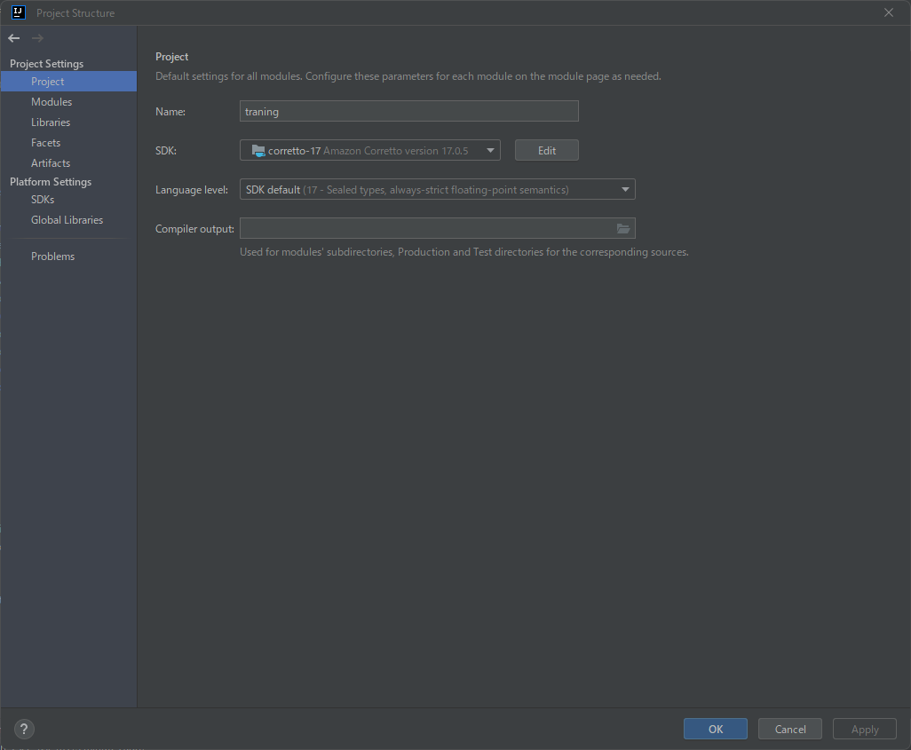
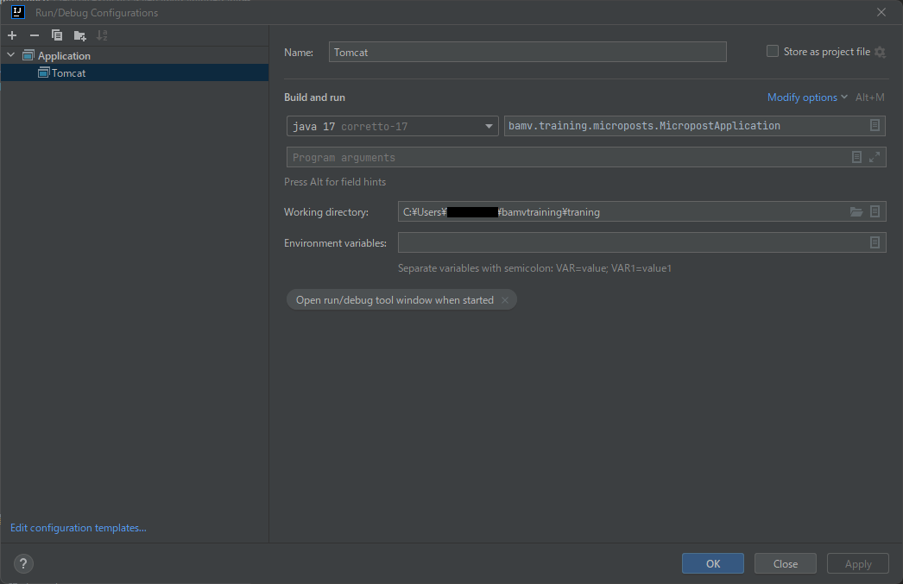
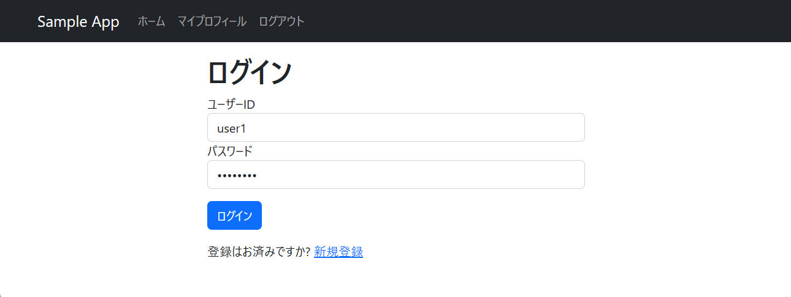
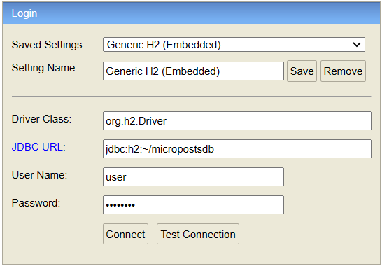

# 事前学習用課題 Micropost アプリケーション
本アプリケーションは事前学習用の教材アプリケーションです
 
## 想定開発環境
IntelliJ IDEA

※参考図書 第2部・第6部も参照のこと

## 構成
Java 17

Spring Boot 2

Tomcat 10

H2 Database

Thymeleaf

※参考図書 第6部も参照のこと

## 環境構築
参考図書 第2部・第6部を参照のこと
 
## 起動方法
1.プロジェクト構造の設定

2.実行/デバッグ構成の設定

3.Shift+F10キー（もしくは実行構成の右側にある実行アイコン）を押してプロジェクトを実行

4.ブラウザから http://localhost:8080/micropostshome にアクセス

※参考図書 第6部も参照のこと

## ログインパスワード
### Micropostsアプリ

USER ID: user1

Password: password

### H2コンソール

JDBC URL: jdbc:h2:~/micropostsdb

User Name: user

Password: password

※ H2コンソールについては参考図書 第6部も参照のこと

